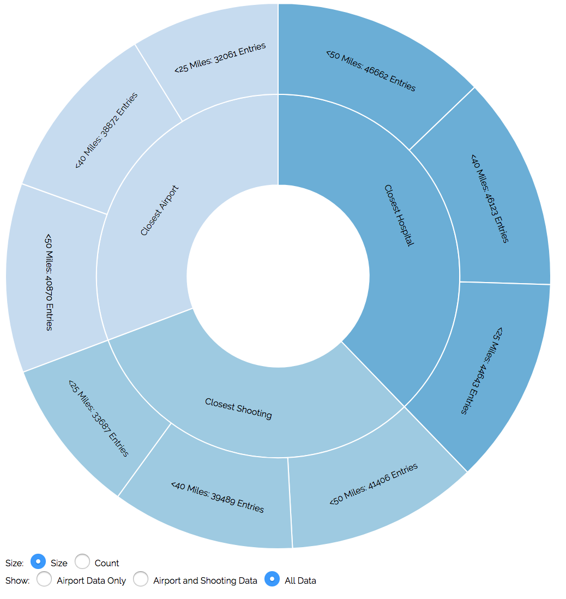
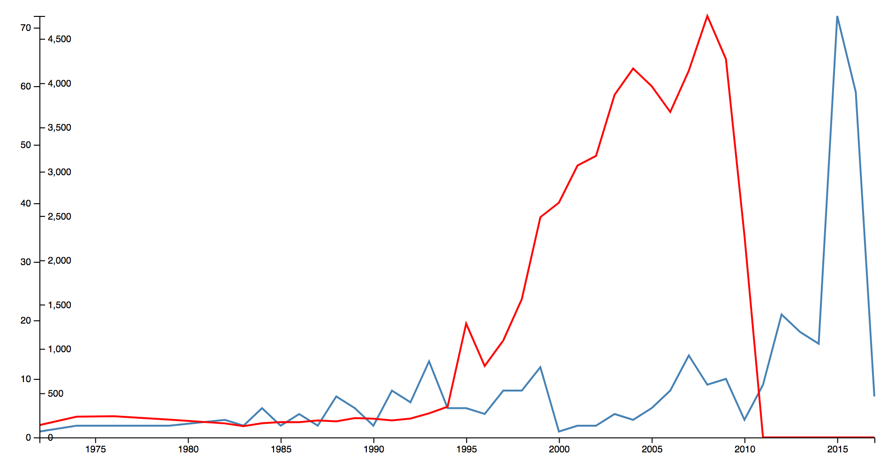
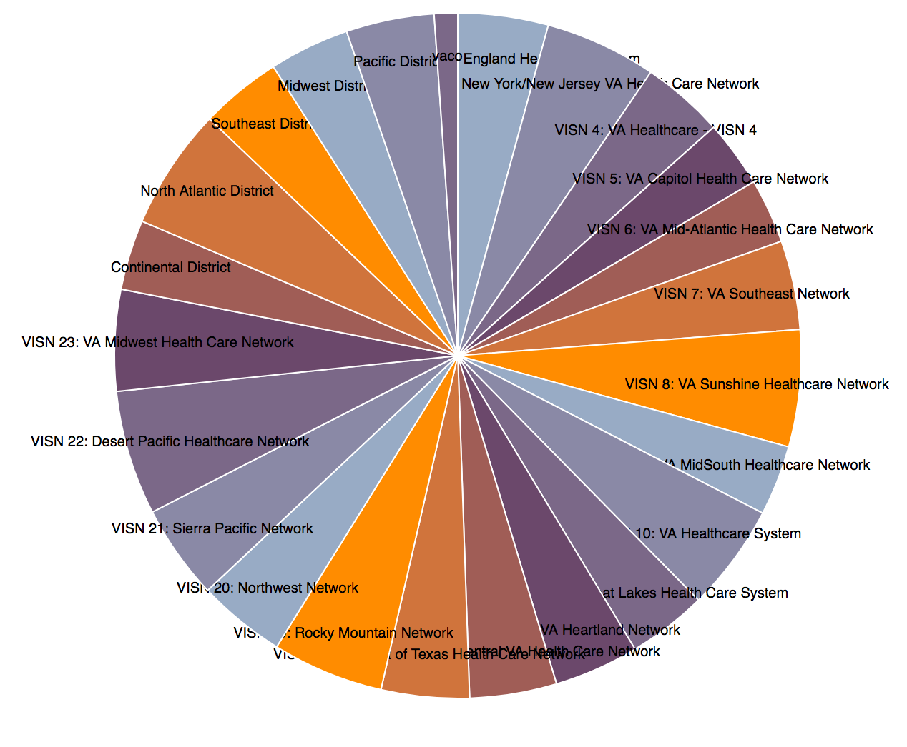
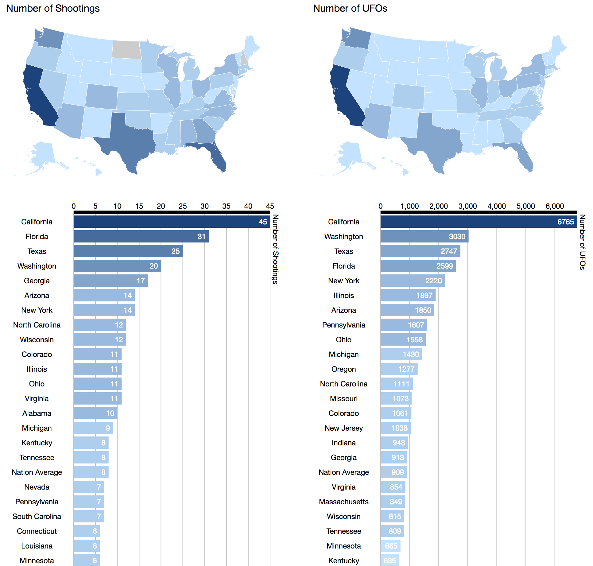
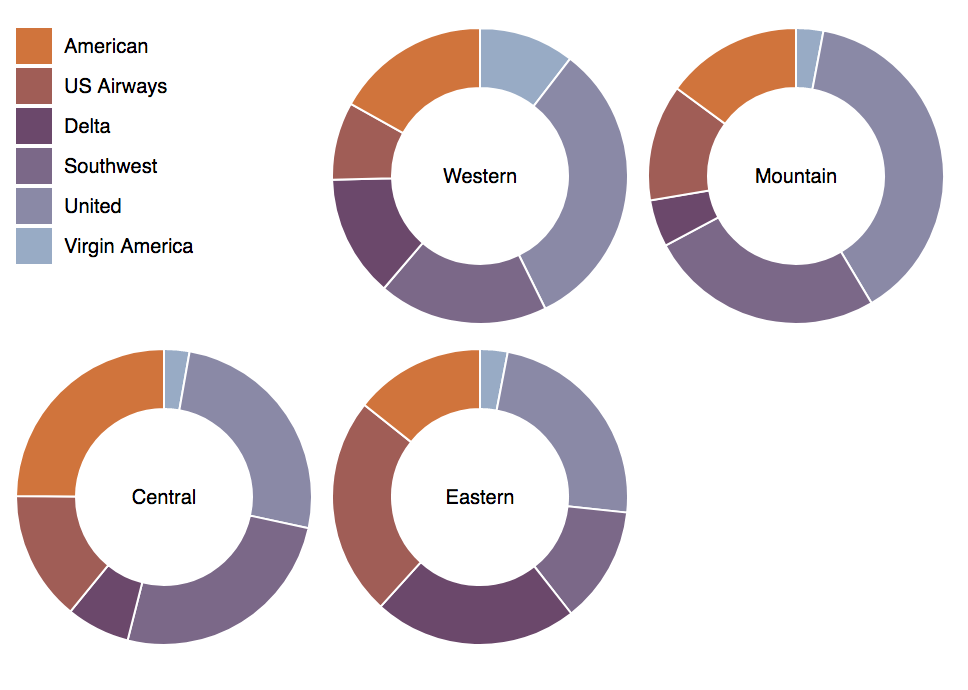
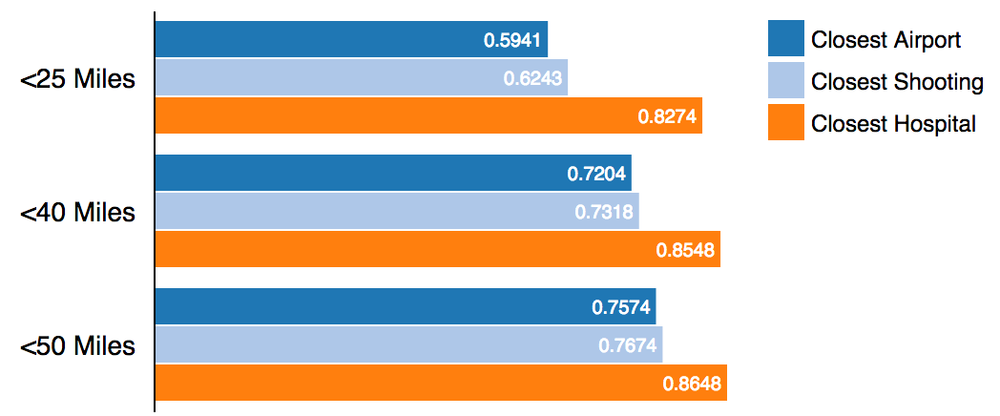
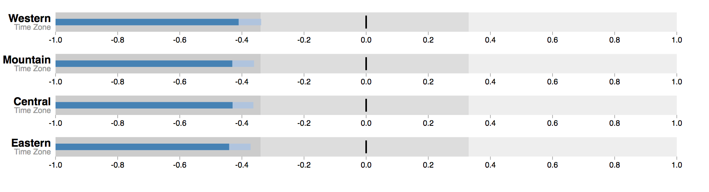
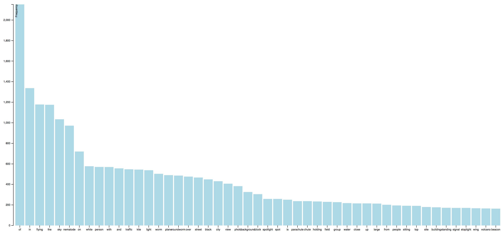
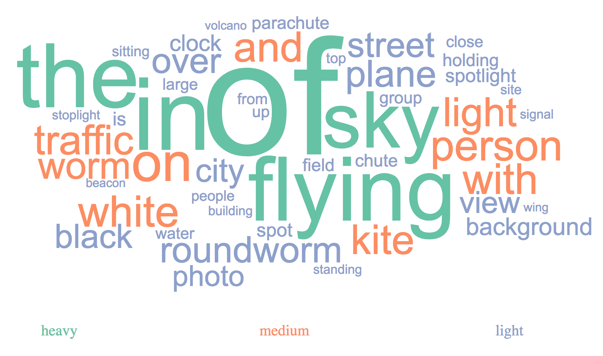
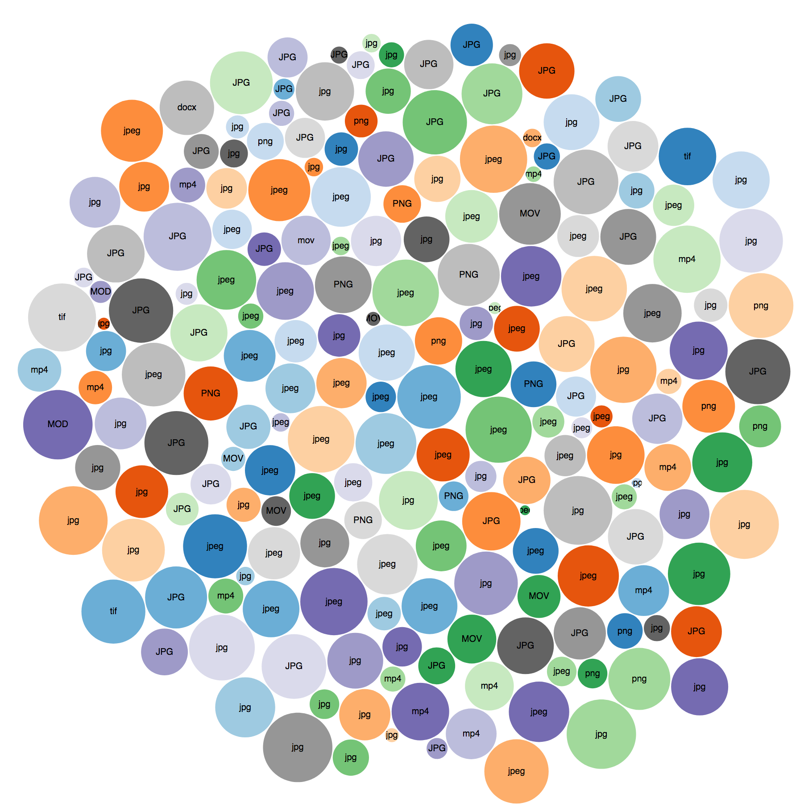

# 10 UFO Visualizations 

Visualizations of the UFO data in the ufo-analysis repository. This includes relationships with data pertaining to airport distance, mass shootings, and twitter sentiments.

### 1. Sunburst - Change in UFO Sightings as Airport distance Increases

### 2. Multiple line graph in v4 from JSON and draw() - Year UFO Sightings & Year Mass Shootings

### 3. Pie Chart - VA Hospital Region Count

### 4. US State Maps Side by Side - State UFO Sightings compared to mass shootings

### 5. Donut Multiples - Twitter Airline Predominance over diff regions 

### 6. Grouped Bar Chart - UFO Distance to Closest Airport, Shooting, and Hospital as Airport Distance Increases

### 7. Bullet Chart - Twiiter Airline Sentiment

### 8. Word Frequency Bar Graph  - UFO Stalker Object Captioning

### 9. WordCloud - Object Captioning 

### 10. Bubble Chart - URL type Info (just got the first 200 entries. Both JSON and CSV, But visualization works with CSV)

#### Additional Scripts (for JSON files that couldnt be easily extracted from the TSV data)

Get Hospital Region Count  
Get State Info  
Get Twitter Airlines  
Get UFO Word Frequency  
Get Year Info  
